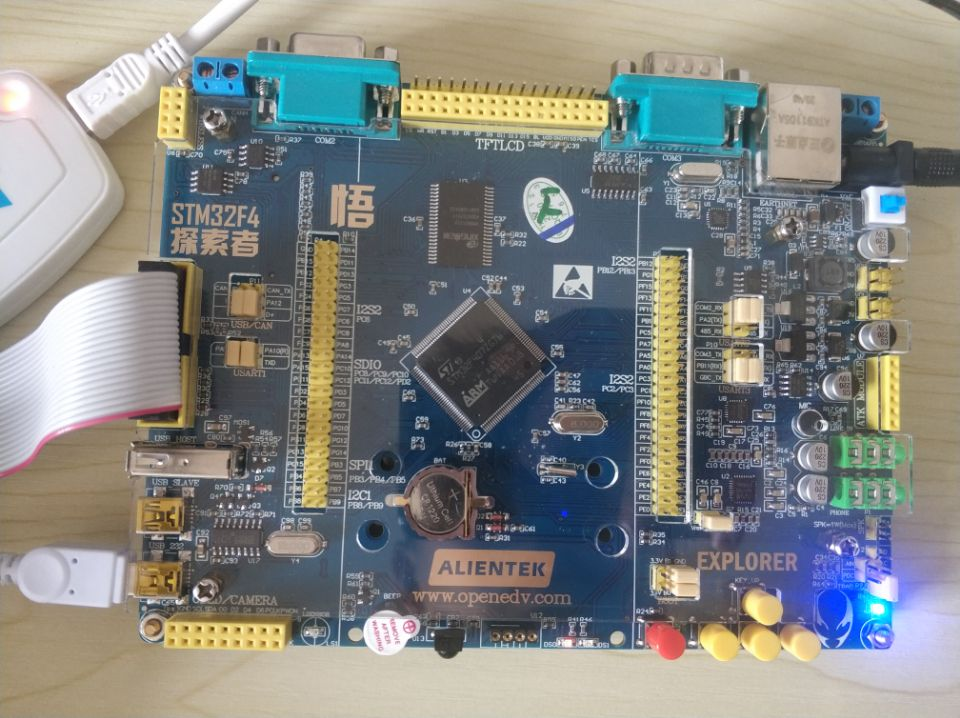
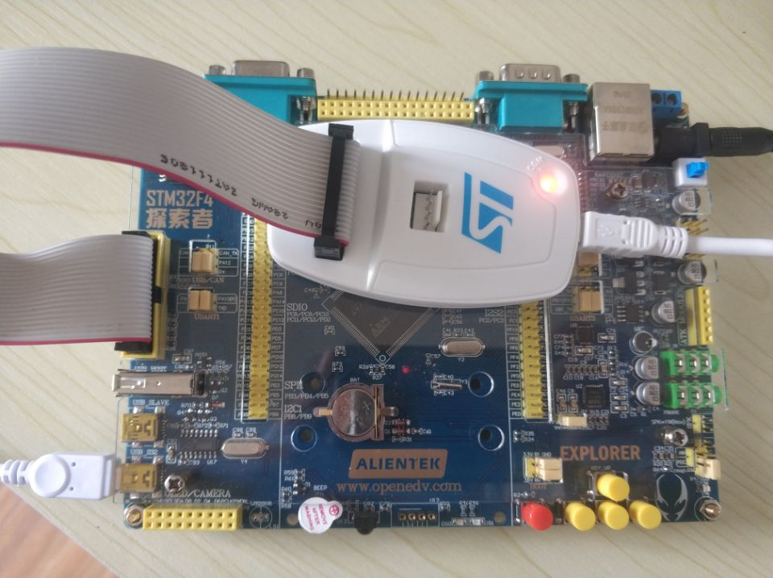
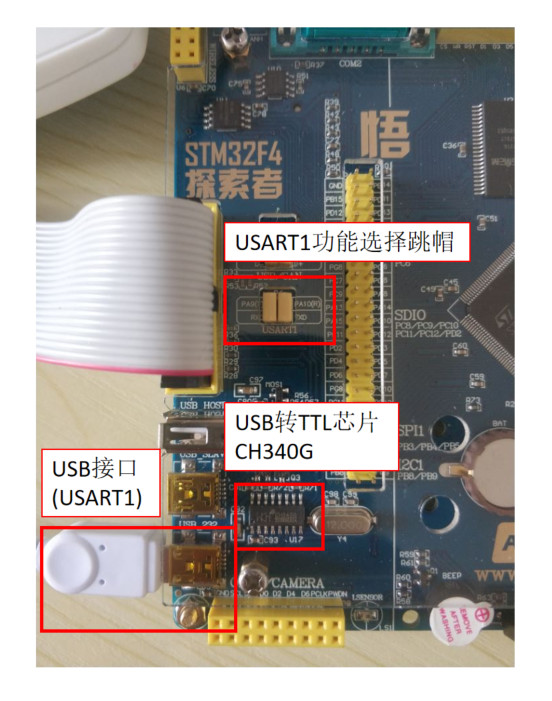
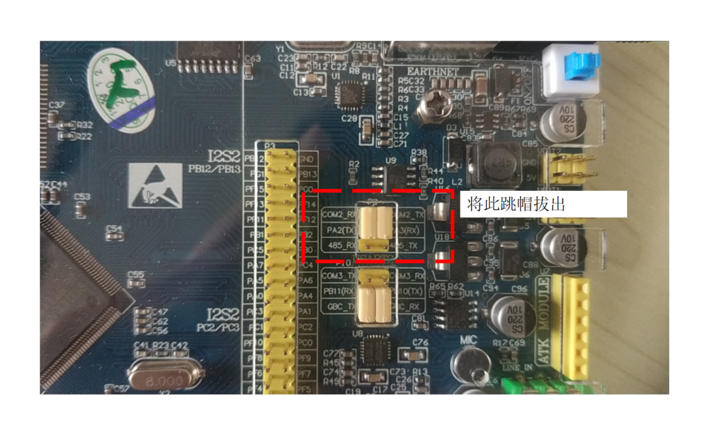
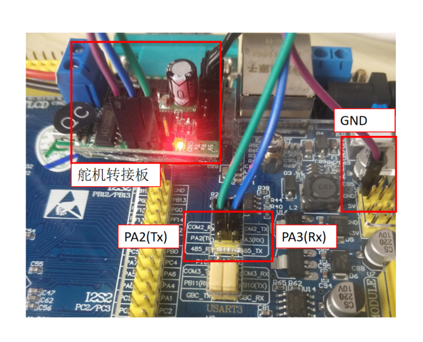
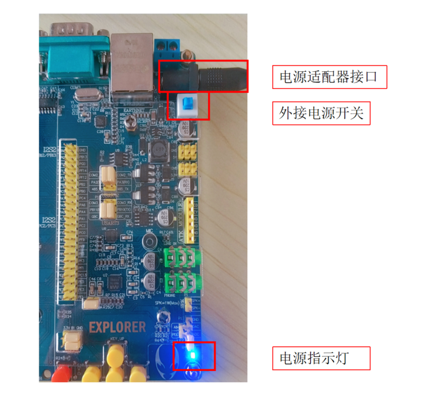
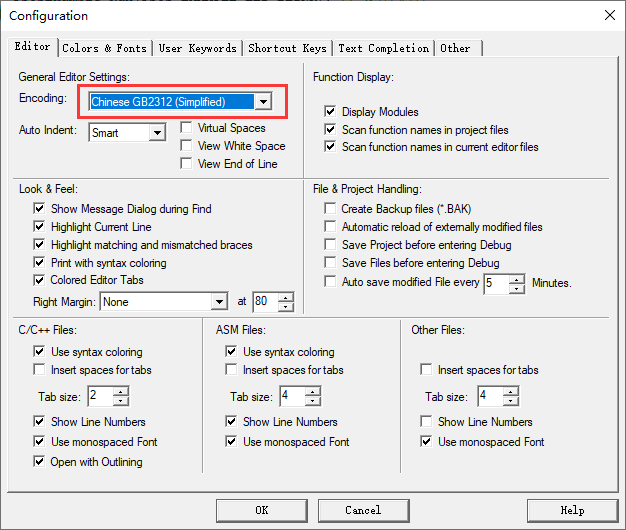
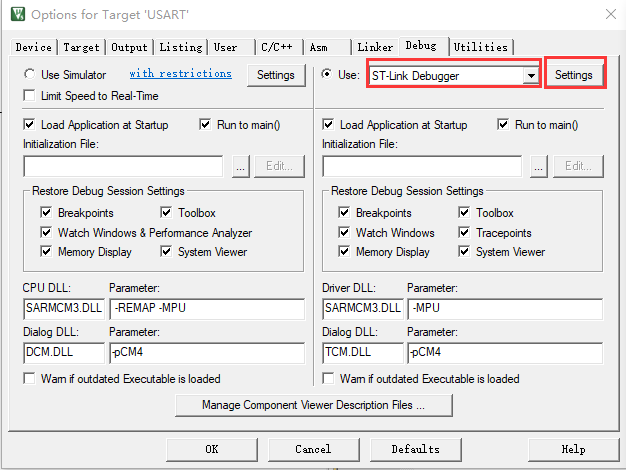
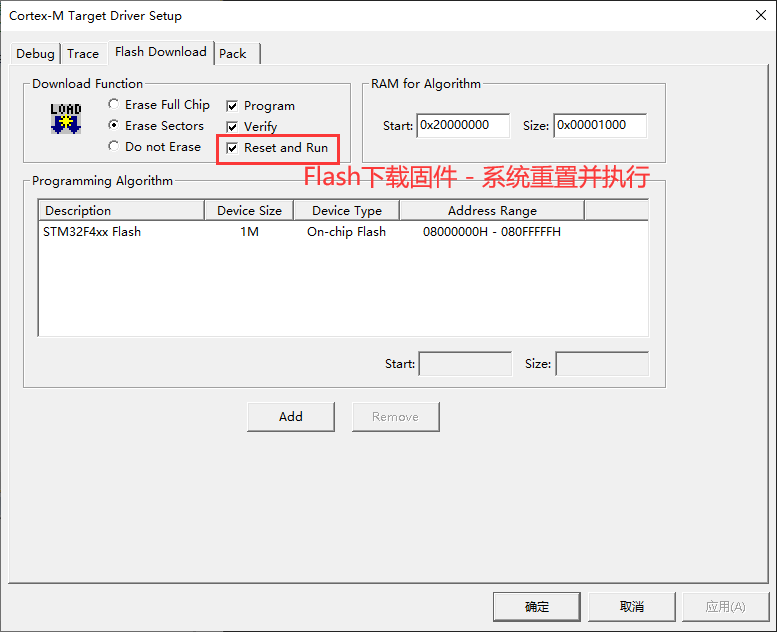
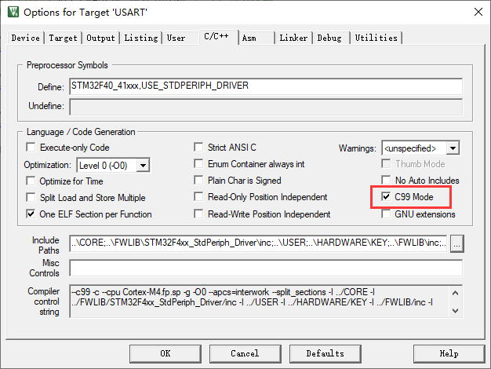

# 开发准备工作

[toc]

* 作者: 阿凯爱玩机器人
* Email: kyle.xing@fashionstar.com.hk

## 硬件

### 开发板

开发板型号: 正点原子STM32F4探索者开发板

IC型号: STM32F407ZGT6

[stm32f407探索者开发板-WIKI](http://www.openedv.com/docs/boards/stm32/zdyz_stm32f407_explorer.html)

> 注: 你也可以选择其他的STM32F4系列的单片机/开发板， 需要自行移植. 

### STLinkV2

开发板连接STLinkV2

### USART1-USB转串口

正点原子的开发板上自带了一个USB转TLL模块(CH340G), 连接到STM32F407的USART1上. 

标注为`USB_232` , 连接到电脑上. 

### USART2-串口总线舵机通信

跳帽选择`COM2_RX`与`COM2_TX` 相连接，将其作为普通的USART使用。

| STM32F4         | 舵机转接板 | 备注                                     |
| --------------- | ---------- | ---------------------------------------- |
| PA2 (USART2 Tx) | RX         |                                          |
| PA3 (USART2 Rx) | TX         |                                          |
| GND             | GND        |                                          |
| 5v              | 5v         | 可选，因为开发板与舵机转接板是独立供电的 |

### 开发板外接电源

* USB供电(USB_232接口) / 电源适配器供电。
* 打开开发板的电源开关

> 注: 要在接线以及跳帽功能选择完成之后，再上电. 

## Keil5 的配置

### Keil-设置编码格式

设置Keil代码编辑器的默认编码为 `Chinese GB2312 (Simplified)`

设置路径: `Eidt`  -> `Configuration` 

### Keil-调试器选项

设置调试工具`ST-Link Debugger`

勾选`Reset and Run`选项， 方便测试. 

### Keil-设置编译标准

正点原子的代码示例，默认C99选项没有被勾选，需要手动勾选.

